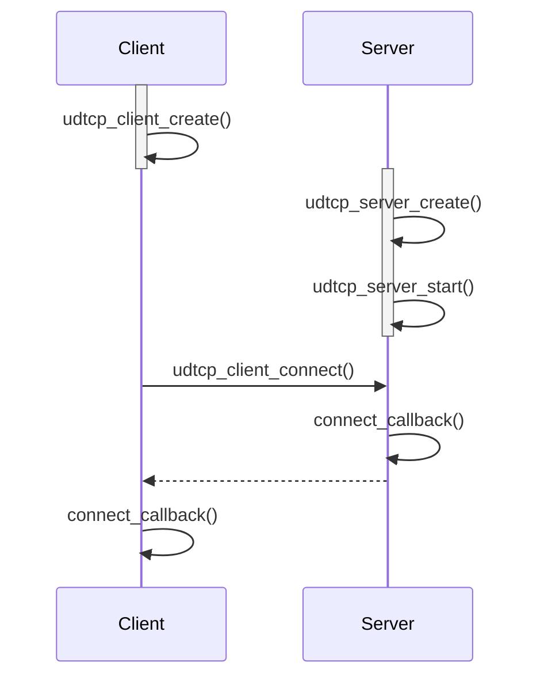

# UDTCP

Communication with protocol UDP and TCP

```mermaid
sequenceDiagram
activate Client
Client->>Client: udtcp_client_create()
deactivate Client
activate Server
Server->>Server: udtcp_server_create()
Server->>Server: udtcp_server_start()
deactivate Server
Client->>Server: udtcp_client_connect()
Server->>Server: connect_callback()
Server-->>Client: 
Client->>Client: connect_callback()
```

    

